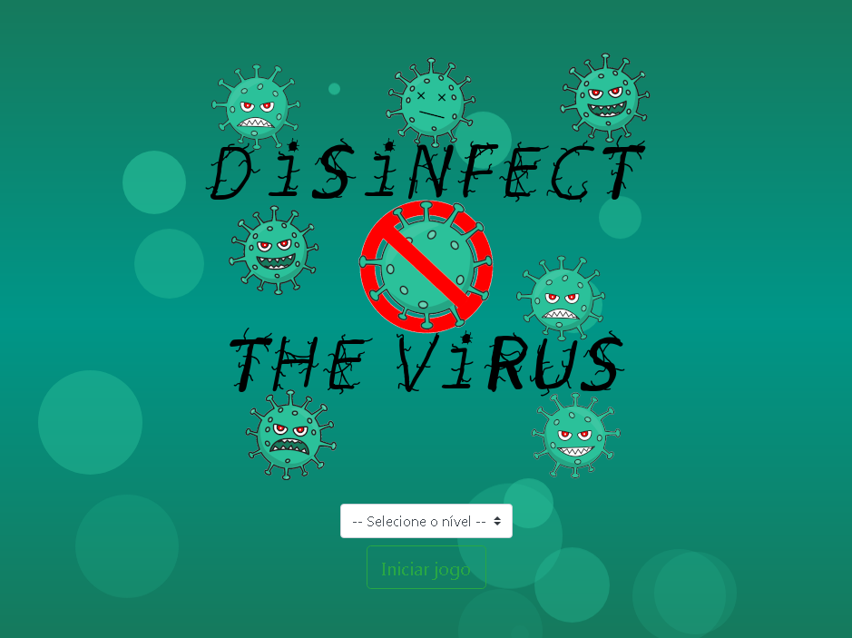
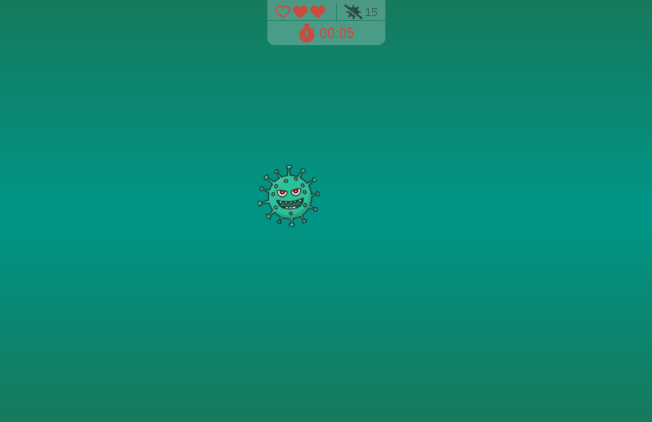

<p align="center">	
	<h1 align="center">Desinfete o vírus</h1>
</p>
<p align="center">
    
</p>
    <p align="center"><em>Desinfete e elimine todos os vírus.</em></p>
    <p align="center">
        
        
  	</p>
</p>

<p align="center">
	
	
	
	
</p>

## Traduções :triangular_flag_on_post:

* :brazil: [Original](https://github.com/JefersonLucas/disinfect-the-virus/blob/master/README.md)
* :us: [English](https://github.com/JefersonLucas/disinfect-the-virus/blob/master/translations/en/README.md)

## Começando :heavy_check_mark:

Essas instruções fornecerão uma cópia do projeto em execução na sua máquina local.

### Instalando :inbox_tray:

Siga passo a passo as seguinte formas de obter o código na sua máquina local.

#### Clonando o repositório

Inicie o repositorio na sua máquina local utilizando as linhas de comando.

```
#Clonar com SSH

mkdir disinfect-the-virus
cd disinfect-the-virus
git init
git clone git@github.com:JefersonLucas/disinfect-the-virus.git
```

```
#Clonar com HTTPS

mkdir disinfect-the-virus
cd disinfect-the-virus
git init
git clone https://github.com/JefersonLucas/disinfect-the-virus.git
```
Agora os arquivos que estão no repositório remoto estão clonados no repositório local.

#### Baixando o repositório

Você também pode [baixar](https://github.com/JefersonLucas/disinfect-the-virus/archive/master.zip) o repositório em formato zip.

## Ambiente :desktop_computer:

Veja aqui o a página do projeto implantado por @github-pages [ver implantação](https://jefersonlucas.github.io/disinfect-the-virus/).

## Construído com :building_construction:

* [Bootstrap](https://getbootstrap.com/) - Framework front end.
* [Dafont](https://www.dafont.com/virus-2.font) - Banco de fontes.
* [Font Awesome](https://fontawesome.com/) - Framework de pacote de ícones.
* [pngtree](https://pngtree.com/so/micróbios-bacterianos) - Banco de imagens.

## Contribuindo :up:

Leia o [CONTRIBUTING.md](https://github.com/JefersonLucas/disinfect-the-virus/blob/master/CONTRIBUTING.md) para obter detalhes sobre nosso código de conduta e o processo para enviar solicitações pull para nós.

## Versionamento :label:

Usamos o [SemVer](https://semver.org/lang/pt-BR/) para controle de versão. Para as versões disponíveis, consulte as [tags nesse repositório](https://github.com/JefersonLucas/disinfect-the-virus/tags). 

## Autores :pray:

* **Jeferson Lucas** - *Trabalho Inicial* - [JefersonLucas](https://github.com/JefersonLucas).

Veja também a lista de [contribuidores](https://github.com/JefersonLucas/disinfect-the-virus/contributors) que participaram deste projeto.

## Licença :copyright:

Este projeto está licenciado sob a licença MIT - consulte o arquivo [LICENSE.md](https://github.com/JefersonLucas/disinfect-the-virus/blob/master/LICENSE) para obter detalhes.

## Agradecimentos :clap:

* Primeiramente a Deus. 
* Meus sinceros agradecimentos a todos que visitam o projeto e deixa uma estrela como reconhecimento.
* Ao meu professor [Jorge Sant Ana](https://twitter.com/jorgesantanabr) pela inspiração.
